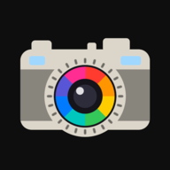

<div align="center">

<h1>&nbsp;Shkarno</h1>

**A free, private RAW photo editor that runs in your browser.**
iPhone ProRAW · DNG · HEIC · JPEG — edited on your device, never uploaded.

[**Open Shkarno →**](https://img.jenyadoesapps.com/)

</div>

---

## Why Shkarno

- **Private by design.** Photos are decoded, edited and exported on your device. Nothing
  is uploaded, and there is no account.
- **Real RAW development.** ProRAW and camera DNG files are developed from the sensor
  data on the GPU, not edited as flattened JPEGs.
- **One tap to a good start.** The automatic development matches the look your phone
  gave the photo, then lets you take it further.
- **Works everywhere.** iPhone, Android and desktop browsers with WebGPU. Install it to
  your home screen and it works offline.

## Features

| | |
|---|---|
| **Automatic development** | Exposure, tone, white balance and colour set per photo, calibrated to the camera's own rendering. |
| **AI scene understanding** | Sky, people, vegetation and buildings are recognised, and depth is estimated, for region-aware edits. |
| **Layers and smart masks** | Curves, colour, gradients and more, masked by subject, region, distance, colour or a single tap. |
| **Magic brush** | Paint over a person, a wire or a stain and it disappears, filled in from its surroundings. |
| **Lens and motion blur** | Portrait-style depth of field, and motion blur sideways or into the depth of the scene. |
| **Fog and light** | Atmospheric fog that thickens with distance; fill light that fades into the scene like a flash. |
| **Film emulation** | Clean analog, negative film and cinema looks with film grain, halation and bloom. |
| **Finishing tools** | Tone and contrast equalizers, HDR highlights, dehaze, vignette, denoise and AI 2× upscaling. |
| **Export** | JPEG, Ultra HDR JPEG, HEIC, 16-bit TIFF and DNG, in Display P3 or sRGB, at full resolution. |

## Supported devices

Any browser with WebGPU:

- **iPhone and iPad** — Safari on iOS / iPadOS 26
- **Mac** — Safari on macOS 26, Chrome, Edge
- **Android and Windows** — Chrome, Edge

Formats: Apple ProRAW and other DNG, camera RAW, HEIC/HEIF, JPEG, PNG.

## How it works

Shkarno decodes RAW files with LibRaw compiled to WebAssembly, runs every pixel
operation in WebGPU compute shaders, and runs its neural networks (segmentation, depth,
selection, inpainting, upscaling) with ONNX Runtime Web — all inside the browser.
Architecture and colour science: [docs/PIPELINE.md](docs/PIPELINE.md).

## Development

```sh
npm install
npm run dev      # http://localhost:5173
npm test
npm run build
```

More in [docs/DEVELOPMENT.md](docs/DEVELOPMENT.md).

## Credits

Built with LibRaw, libheif and ONNX Runtime Web, and the SegFormer, Depth Anything V2,
MobileSAM, Swin2SR, LaMa and MI-GAN models. Licences:
[THIRD_PARTY_NOTICES](public/THIRD_PARTY_NOTICES.txt) — the SegFormer weights are
licensed for non-commercial use only.
